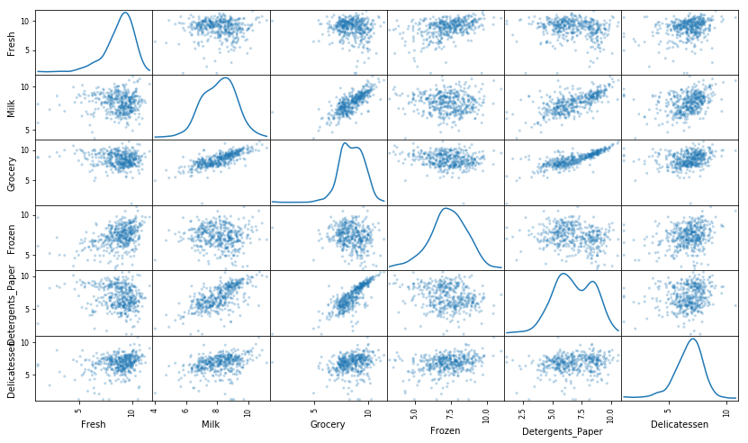
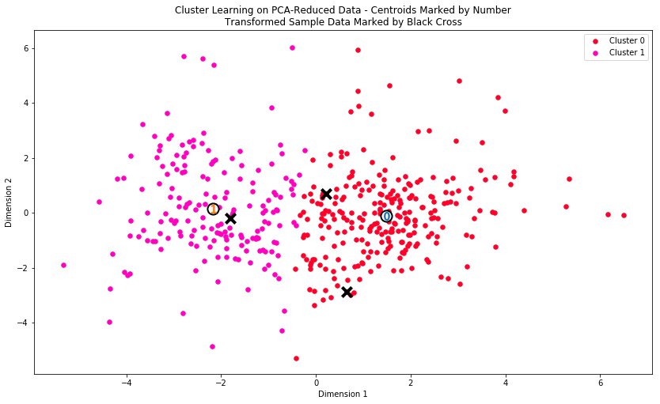

## 非监督学习项目: 创建用户分类

## 背景
近日，一家批发经销商尝试着针对一些客户改变其发货方式，从原来的每周五次每次早上发货，改为了更为便宜的每周三次每次晚上发货。起初，发货方式的改变并没有带来任何显著的负面结果，于是该批发商将这一更为便宜的变动推广到了所有客户。几乎同一时刻，该批发商开始收到客户对发货服务变动的投诉，也有的客户开始取消提货。该批发商受到的损失比节省下来的钱还要多。现在，该批发经销商雇佣你，希望你确定他们的客户特征和信息，以帮助它们在未来做出更加明智的商业决策。你的任务就是利用非监督学习技术，看看客户之间存在哪些相似之处，以及如何以最佳的方式将客户细分为不同类别。

## 开始

这个项目的任务之一是如何最好地描述一个批发商不同种类顾客之间的差异。这样做将能够使得批发商能够更好的组织他们的物流服务以满足每个客户的需求。

这个项目的数据集能够在[UCI机器学习信息库](https://archive.ics.uci.edu/ml/datasets/Wholesale+customers)中找到.因为这个项目的目的，分析将不会包括'Channel'和'Region'这两个特征——重点集中在6个记录的客户购买的产品类别上。

```python
# 引入这个项目需要的库
import numpy as np
import pandas as pd
import visuals as vs
import seaborn as sns
import matplotlib
import matplotlib.pyplot as plt
from IPython.display import display # 使得我们可以对DataFrame使用display()函数

# 设置以内联的形式显示matplotlib绘制的图片（在notebook中显示更美观）
%matplotlib inline
matplotlib.rcParams["figure.figsize"] = (14, 10)
# 载入整个客户数据集
try:
    data = pd.read_csv("customers.csv")
    data.drop(['Region', 'Channel'], axis = 1, inplace = True)
    print("Wholesale customers dataset has {} samples with {} features each.".format(*data.shape)) 
except:
    print("Dataset could not be loaded. Is the dataset missing?") 
```

    Wholesale customers dataset has 440 samples with 6 features each.
    
## 分析数据
在这部分，通过可视化和代码来理解每一个特征和其他特征的联系。会看到关于数据集的统计描述，考虑每一个属性的相关性，然后从数据集中选择若干个样本数据点，将在整个项目中一直跟踪研究这几个数据点。

这个数据集包含了6个重要的产品类型：**'Fresh'**, **'Milk'**, **'Grocery'**, **'Frozen'**, **'Detergents_Paper'**和 **'Delicatessen'**。考虑这里每一个类型代表你会购买什么样的产品。

```python
# 显示数据集的一个描述
display(data.describe())
```


<div>

<table border="1" class="dataframe">
  <thead>
    <tr style="text-align: right;">
      <th></th>
      <th>Fresh</th>
      <th>Milk</th>
      <th>Grocery</th>
      <th>Frozen</th>
      <th>Detergents_Paper</th>
      <th>Delicatessen</th>
    </tr>
  </thead>
  <tbody>
    <tr>
      <th>count</th>
      <td>440.000000</td>
      <td>440.000000</td>
      <td>440.000000</td>
      <td>440.000000</td>
      <td>440.000000</td>
      <td>440.000000</td>
    </tr>
    <tr>
      <th>mean</th>
      <td>12000.297727</td>
      <td>5796.265909</td>
      <td>7951.277273</td>
      <td>3071.931818</td>
      <td>2881.493182</td>
      <td>1524.870455</td>
    </tr>
    <tr>
      <th>std</th>
      <td>12647.328865</td>
      <td>7380.377175</td>
      <td>9503.162829</td>
      <td>4854.673333</td>
      <td>4767.854448</td>
      <td>2820.105937</td>
    </tr>
    <tr>
      <th>min</th>
      <td>3.000000</td>
      <td>55.000000</td>
      <td>3.000000</td>
      <td>25.000000</td>
      <td>3.000000</td>
      <td>3.000000</td>
    </tr>
    <tr>
      <th>25%</th>
      <td>3127.750000</td>
      <td>1533.000000</td>
      <td>2153.000000</td>
      <td>742.250000</td>
      <td>256.750000</td>
      <td>408.250000</td>
    </tr>
    <tr>
      <th>50%</th>
      <td>8504.000000</td>
      <td>3627.000000</td>
      <td>4755.500000</td>
      <td>1526.000000</td>
      <td>816.500000</td>
      <td>965.500000</td>
    </tr>
    <tr>
      <th>75%</th>
      <td>16933.750000</td>
      <td>7190.250000</td>
      <td>10655.750000</td>
      <td>3554.250000</td>
      <td>3922.000000</td>
      <td>1820.250000</td>
    </tr>
    <tr>
      <th>max</th>
      <td>112151.000000</td>
      <td>73498.000000</td>
      <td>92780.000000</td>
      <td>60869.000000</td>
      <td>40827.000000</td>
      <td>47943.000000</td>
    </tr>
  </tbody>
</table>
</div>


### 选择样本
为了对客户有一个更好的了解，并且了解代表他们的数据将会在这个分析过程中如何变换。最好是选择几个样本数据点，并且更为详细地分析它们。在下面我选择了**三个**索引加入到索引列表`indices`中，这三个索引代表要追踪的客户。

```python
data.describe().plot(kind="box", figsize=(14,8))
plt.ylim(0, 20000)
```
    (0, 20000)


```python
# 从数据集中选择三个希望抽样的数据点的索引
np.random.seed(42)

indices = [np.random.randint(len(data)),np.random.randint(len(data)),np.random.randint(len(data))]

# 为选择的样本建立一个DataFrame
samples = pd.DataFrame(data.loc[indices], columns = data.keys()).reset_index(drop = True)
print("Chosen samples of wholesale customers dataset:") 
display(samples)
```

    Chosen samples of wholesale customers dataset:
    
<div>

<table border="1" class="dataframe">
  <thead>
    <tr style="text-align: right;">
      <th></th>
      <th>Fresh</th>
      <th>Milk</th>
      <th>Grocery</th>
      <th>Frozen</th>
      <th>Detergents_Paper</th>
      <th>Delicatessen</th>
    </tr>
  </thead>
  <tbody>
    <tr>
      <th>0</th>
      <td>2932</td>
      <td>6459</td>
      <td>7677</td>
      <td>2561</td>
      <td>4573</td>
      <td>1386</td>
    </tr>
    <tr>
      <th>1</th>
      <td>29703</td>
      <td>12051</td>
      <td>16027</td>
      <td>13135</td>
      <td>182</td>
      <td>2204</td>
    </tr>
    <tr>
      <th>2</th>
      <td>3428</td>
      <td>2380</td>
      <td>2028</td>
      <td>1341</td>
      <td>1184</td>
      <td>665</td>
    </tr>
  </tbody>
</table>
</div>

*对每一个你选择的样本客户，通过它在每一种产品类型上的花费与数据集的统计描述进行比较，判断它们大概属于什么类型的客户*

1. 第一个样本点，`"Milk"`,`"Grocery"`,`"Frozen"`,`"Delicatessen"` 高于median，推测是咖啡馆, 餐厅
2. 第二个样本点，"Grocery"和"Fresh"远高于median，推测为超市
3. 第三个样本点，所有特征均低于median，`"Fresh"`,`"Milk"`占比高，推测是餐厅

### 特征相关性
一个有趣的想法是，考虑这六个类别中的一个（或者多个）产品类别，是否对于理解客户的购买行为具有实际的相关性。也就是说，当用户购买了一定数量的某一类产品，我们是否能够确定他们必然会成比例地购买另一种类的产品。有一个简单的方法可以检测相关性：我们用移除了某一个特征之后的数据集来构建一个监督学习（回归）模型，然后用这个模型去预测那个被移除的特征，再对这个预测结果进行评分，看看预测结果如何。

 - 使用`DataFrame.drop`函数移除数据集中你选择的不需要的特征，并将移除后的结果赋值给`new_data`。
 - 使用`sklearn.model_selection.train_test_split`将数据集分割成训练集和测试集。
   - 使用移除的特征作为你的目标标签。设置`test_size`为`0.25`并设置一个`random_state`。
 - 导入一个DecisionTreeRegressor（决策树回归器），设置一个`random_state`，然后用训练集训练它。
 - 使用回归器的`score`函数输出模型在测试集上的预测得分。


```python
from sklearn.model_selection import train_test_split
from sklearn.tree import DecisionTreeRegressor
# 为DataFrame创建一个副本，用'drop'函数丢弃一个特征
new_data = data.drop(["Delicatessen"], axis=1)

# 使用给定的特征作为目标，将数据分割成训练集和测试集
X_train, X_test, y_train, y_test = train_test_split(new_data, data["Delicatessen"], test_size=0.25, random_state=42)

# 创建一个DecisionTreeRegressor（决策树回归器）并在训练集上训练它
regressor = DecisionTreeRegressor(random_state=42)
regressor.fit(X_train, y_train)

# 输出在测试集上的预测得分
score = regressor.score(X_test, y_test)

score
```

    -2.254711537203931

*决定系数（coefficient of determination）, `R^2`,结果在0到1之间，1表示完美拟合，一个负的`R^2`表示模型不能够拟合数据。*

**尝试预测"Delicatessen", 预测得分是-2.25，这个特征与其他特征相关性不大，因此对于区分用户的消费习惯是有必要的**

### 可视化特征分布
为了能够对这个数据集有一个更好的理解，我们可以对数据集中的每一个产品特征构建一个散布矩阵（scatter matrix）。如果你发现你在上面尝试预测的特征对于区分一个特定的用户来说是必须的，那么这个特征和其它的特征可能不会在下面的散射矩阵中显示任何关系。相反的，如果你认为这个特征对于识别一个特定的客户是没有作用的，那么通过散布矩阵可以看出在这个数据特征和其它特征中有关联性。

```python
# 对于数据中的每一对特征构造一个散布矩阵
pd.plotting.scatter_matrix(data, alpha = 0.3, figsize = (14,8), diagonal = 'kde');
```


```python
sns.heatmap(data.astype(float).corr(), vmax=1.0, annot=True)
```

    <matplotlib.axes._subplots.AxesSubplot at 0x174260f0>


### 特征相关性

1. "Milk" 和 "Detergents_Paper", "Grocery"有较强相关， "Grocery" 和"Detergents_Paper"强相关。  
2. 这些结果验证了我预测的"Delicatessen"的相关性，与其他变量相关性都不高。  
3. 数据呈正偏斜分布，大多数据分布在0-10000

## 数据预处理
在这个部分，通过在数据上做一个合适的缩放，并检测异常点（选择性移除）将数据预处理成一个更好的代表客户的形式。预处理数据是保证你在分析中能够得到显著且有意义的结果的重要环节。

### 特征缩放
如果数据不是正态分布的，尤其是数据的平均数和中位数相差很大的时候（表示数据非常歪斜）。这时候通常用一个非线性的缩放是[很合适的](https://github.com/czcbangkai/translations/blob/master/use_of_logarithms_in_economics/use_of_logarithms_in_economics.pdf)，[（英文原文）](http://econbrowser.com/archives/2014/02/use-of-logarithms-in-economics) — 尤其是对于金融数据。一种实现这个缩放的方法是使用[Box-Cox 变换](http://scipy.github.io/devdocs/generated/scipy.stats.boxcox.html)，这个方法能够计算出能够最佳减小数据倾斜的指数变换方法。一个比较简单的并且在大多数情况下都适用的方法是使用自然对数。

 - 使用`np.log`函数在数据 `data` 上做一个对数缩放，然后将它的副本（不改变原始data的值）赋值给`log_data`。
 - 使用`np.log`函数在样本数据 `samples` 上做一个对数缩放，然后将它的副本赋值给`log_samples`。

```python
# 使用自然对数缩放数据
log_data = np.log(data)

# 使用自然对数缩放样本数据
log_samples = np.log(samples)

# 为每一对新产生的特征制作一个散射矩阵
pd.plotting.scatter_matrix(log_data, alpha = 0.3, figsize = (14,8), diagonal = 'kde');
```



转换后的皮尔逊相关系数

```python
sns.heatmap(log_data.astype(float).corr(), vmax=1.0, annot=True)
```

    <matplotlib.axes._subplots.AxesSubplot at 0x16601668>


### 观察
在使用了一个自然对数的缩放之后，数据的各个特征会显得更加的正态分布。对于任意的你以前发现有相关关系的特征对，观察他们的相关关系是否还是存在的（并且尝试观察，他们的相关关系相比原来是变强了还是变弱了）。

运行下面的代码以观察样本数据在进行了自然对数转换之后如何改变了。

```python
# 展示经过对数变换后的样本数据
display(log_samples)
```

<div>

<table border="1" class="dataframe">
  <thead>
    <tr style="text-align: right;">
      <th></th>
      <th>Fresh</th>
      <th>Milk</th>
      <th>Grocery</th>
      <th>Frozen</th>
      <th>Detergents_Paper</th>
      <th>Delicatessen</th>
    </tr>
  </thead>
  <tbody>
    <tr>
      <th>0</th>
      <td>7.983440</td>
      <td>8.773230</td>
      <td>8.945984</td>
      <td>7.848153</td>
      <td>8.427925</td>
      <td>7.234177</td>
    </tr>
    <tr>
      <th>1</th>
      <td>10.299003</td>
      <td>9.396903</td>
      <td>9.682030</td>
      <td>9.483036</td>
      <td>5.204007</td>
      <td>7.698029</td>
    </tr>
    <tr>
      <th>2</th>
      <td>8.139732</td>
      <td>7.774856</td>
      <td>7.614805</td>
      <td>7.201171</td>
      <td>7.076654</td>
      <td>6.499787</td>
    </tr>
  </tbody>
</table>
</div>


### 异常值检测
对于任何的分析，在数据预处理的过程中检测数据中的异常值都是非常重要的一步。异常值的出现会使得把这些值考虑进去后结果出现倾斜。这里有很多关于怎样定义什么是数据集中的异常值的经验法则。这里我们将使用[Tukey的定义异常值的方法](http://datapigtechnologies.com/blog/index.php/highlighting-outliers-in-your-data-with-the-tukey-method/)：一个*异常阶（outlier step）*被定义成1.5倍的四分位距（interquartile range，IQR）。一个数据点如果某个特征包含在该特征的IQR之外的特征，那么该数据点被认定为异常点。

在下面的代码单元中，你需要完成下面的功能：
 - 将指定特征的25th分位点的值分配给`Q1`。使用`np.percentile`来完成这个功能。
 - 将指定特征的75th分位点的值分配给`Q3`。同样的，使用`np.percentile`来完成这个功能。
 - 将指定特征的异常阶的计算结果赋值给`step`.
 - 选择性地通过将索引添加到`outliers`列表中，以移除异常值。

数据集将存储在`good_data`中。


```python
# 对于每一个特征，找到值异常高或者是异常低的数据点
tukey_count = np.zeros(data.shape[0]) # 初始化一个mask，它的长度是数据的长度，全0
for feature in log_data.keys():
    
    # 计算给定特征的Q1（数据的25th分位点）
    Q1 = np.percentile(log_data[feature], 25)
    
    # 计算给定特征的Q3（数据的75th分位点）
    Q3 = np.percentile(log_data[feature], 75)
    
    # 使用四分位范围计算异常阶（1.5倍的四分位距）
    step = 1.5 * (Q3 - Q1)
    
    # 显示异常点
    print("Data points considered outliers for the feature '{}':".format(feature))
    # outliers_index[feature] = log_data[~((log_data[feature] >= Q1 - step) & (log_data[feature] <= Q3 + step))].index
    display(log_data[~((log_data[feature] >= Q1 - step) & (log_data[feature] <= Q3 + step))])
    tukey = ~((log_data[feature] >= Q1 - step) & (log_data[feature] <= Q3 + step))
    tukey_count += tukey.astype(int)
    
# 收集outliers
outliers = np.where(tukey_count > 1)[0]
print("outliers:", outliers)    
# 选择希望移除的数据点的索引
# outliers  = [65, 66, 75, 128, 154]

# 移除异常点
good_data = log_data.drop(log_data.index[outliers]).reset_index(drop = True)
```

    Data points considered outliers for the feature 'Fresh':
    
<div>

<table border="1" class="dataframe">
  <thead>
    <tr style="text-align: right;">
      <th></th>
      <th>Fresh</th>
      <th>Milk</th>
      <th>Grocery</th>
      <th>Frozen</th>
      <th>Detergents_Paper</th>
      <th>Delicatessen</th>
    </tr>
  </thead>
  <tbody>
    <tr>
      <th>65</th>
      <td>4.442651</td>
      <td>9.950323</td>
      <td>10.732651</td>
      <td>3.583519</td>
      <td>10.095388</td>
      <td>7.260523</td>
    </tr>
    <tr>
      <th>66</th>
      <td>2.197225</td>
      <td>7.335634</td>
      <td>8.911530</td>
      <td>5.164786</td>
      <td>8.151333</td>
      <td>3.295837</td>
    </tr>
    <tr>
      <th>81</th>
      <td>5.389072</td>
      <td>9.163249</td>
      <td>9.575192</td>
      <td>5.645447</td>
      <td>8.964184</td>
      <td>5.049856</td>
    </tr>
    <tr>
      <th>95</th>
      <td>1.098612</td>
      <td>7.979339</td>
      <td>8.740657</td>
      <td>6.086775</td>
      <td>5.407172</td>
      <td>6.563856</td>
    </tr>
    <tr>
      <th>96</th>
      <td>3.135494</td>
      <td>7.869402</td>
      <td>9.001839</td>
      <td>4.976734</td>
      <td>8.262043</td>
      <td>5.379897</td>
    </tr>
    <tr>
      <th>128</th>
      <td>4.941642</td>
      <td>9.087834</td>
      <td>8.248791</td>
      <td>4.955827</td>
      <td>6.967909</td>
      <td>1.098612</td>
    </tr>
    <tr>
      <th>171</th>
      <td>5.298317</td>
      <td>10.160530</td>
      <td>9.894245</td>
      <td>6.478510</td>
      <td>9.079434</td>
      <td>8.740337</td>
    </tr>
    <tr>
      <th>193</th>
      <td>5.192957</td>
      <td>8.156223</td>
      <td>9.917982</td>
      <td>6.865891</td>
      <td>8.633731</td>
      <td>6.501290</td>
    </tr>
    <tr>
      <th>218</th>
      <td>2.890372</td>
      <td>8.923191</td>
      <td>9.629380</td>
      <td>7.158514</td>
      <td>8.475746</td>
      <td>8.759669</td>
    </tr>
    <tr>
      <th>304</th>
      <td>5.081404</td>
      <td>8.917311</td>
      <td>10.117510</td>
      <td>6.424869</td>
      <td>9.374413</td>
      <td>7.787382</td>
    </tr>
    <tr>
      <th>305</th>
      <td>5.493061</td>
      <td>9.468001</td>
      <td>9.088399</td>
      <td>6.683361</td>
      <td>8.271037</td>
      <td>5.351858</td>
    </tr>
    <tr>
      <th>338</th>
      <td>1.098612</td>
      <td>5.808142</td>
      <td>8.856661</td>
      <td>9.655090</td>
      <td>2.708050</td>
      <td>6.309918</td>
    </tr>
    <tr>
      <th>353</th>
      <td>4.762174</td>
      <td>8.742574</td>
      <td>9.961898</td>
      <td>5.429346</td>
      <td>9.069007</td>
      <td>7.013016</td>
    </tr>
    <tr>
      <th>355</th>
      <td>5.247024</td>
      <td>6.588926</td>
      <td>7.606885</td>
      <td>5.501258</td>
      <td>5.214936</td>
      <td>4.844187</td>
    </tr>
    <tr>
      <th>357</th>
      <td>3.610918</td>
      <td>7.150701</td>
      <td>10.011086</td>
      <td>4.919981</td>
      <td>8.816853</td>
      <td>4.700480</td>
    </tr>
    <tr>
      <th>412</th>
      <td>4.574711</td>
      <td>8.190077</td>
      <td>9.425452</td>
      <td>4.584967</td>
      <td>7.996317</td>
      <td>4.127134</td>
    </tr>
  </tbody>
</table>
</div>

    Data points considered outliers for the feature 'Milk':
    
<div>

<table border="1" class="dataframe">
  <thead>
    <tr style="text-align: right;">
      <th></th>
      <th>Fresh</th>
      <th>Milk</th>
      <th>Grocery</th>
      <th>Frozen</th>
      <th>Detergents_Paper</th>
      <th>Delicatessen</th>
    </tr>
  </thead>
  <tbody>
    <tr>
      <th>86</th>
      <td>10.039983</td>
      <td>11.205013</td>
      <td>10.377047</td>
      <td>6.894670</td>
      <td>9.906981</td>
      <td>6.805723</td>
    </tr>
    <tr>
      <th>98</th>
      <td>6.220590</td>
      <td>4.718499</td>
      <td>6.656727</td>
      <td>6.796824</td>
      <td>4.025352</td>
      <td>4.882802</td>
    </tr>
    <tr>
      <th>154</th>
      <td>6.432940</td>
      <td>4.007333</td>
      <td>4.919981</td>
      <td>4.317488</td>
      <td>1.945910</td>
      <td>2.079442</td>
    </tr>
    <tr>
      <th>356</th>
      <td>10.029503</td>
      <td>4.897840</td>
      <td>5.384495</td>
      <td>8.057377</td>
      <td>2.197225</td>
      <td>6.306275</td>
    </tr>
  </tbody>
</table>
</div>

    Data points considered outliers for the feature 'Grocery':
    
<div>

<table border="1" class="dataframe">
  <thead>
    <tr style="text-align: right;">
      <th></th>
      <th>Fresh</th>
      <th>Milk</th>
      <th>Grocery</th>
      <th>Frozen</th>
      <th>Detergents_Paper</th>
      <th>Delicatessen</th>
    </tr>
  </thead>
  <tbody>
    <tr>
      <th>75</th>
      <td>9.923192</td>
      <td>7.036148</td>
      <td>1.098612</td>
      <td>8.390949</td>
      <td>1.098612</td>
      <td>6.882437</td>
    </tr>
    <tr>
      <th>154</th>
      <td>6.432940</td>
      <td>4.007333</td>
      <td>4.919981</td>
      <td>4.317488</td>
      <td>1.945910</td>
      <td>2.079442</td>
    </tr>
  </tbody>
</table>
</div>

    Data points considered outliers for the feature 'Frozen':
    
<div>

<table border="1" class="dataframe">
  <thead>
    <tr style="text-align: right;">
      <th></th>
      <th>Fresh</th>
      <th>Milk</th>
      <th>Grocery</th>
      <th>Frozen</th>
      <th>Detergents_Paper</th>
      <th>Delicatessen</th>
    </tr>
  </thead>
  <tbody>
    <tr>
      <th>38</th>
      <td>8.431853</td>
      <td>9.663261</td>
      <td>9.723703</td>
      <td>3.496508</td>
      <td>8.847360</td>
      <td>6.070738</td>
    </tr>
    <tr>
      <th>57</th>
      <td>8.597297</td>
      <td>9.203618</td>
      <td>9.257892</td>
      <td>3.637586</td>
      <td>8.932213</td>
      <td>7.156177</td>
    </tr>
    <tr>
      <th>65</th>
      <td>4.442651</td>
      <td>9.950323</td>
      <td>10.732651</td>
      <td>3.583519</td>
      <td>10.095388</td>
      <td>7.260523</td>
    </tr>
    <tr>
      <th>145</th>
      <td>10.000569</td>
      <td>9.034080</td>
      <td>10.457143</td>
      <td>3.737670</td>
      <td>9.440738</td>
      <td>8.396155</td>
    </tr>
    <tr>
      <th>175</th>
      <td>7.759187</td>
      <td>8.967632</td>
      <td>9.382106</td>
      <td>3.951244</td>
      <td>8.341887</td>
      <td>7.436617</td>
    </tr>
    <tr>
      <th>264</th>
      <td>6.978214</td>
      <td>9.177714</td>
      <td>9.645041</td>
      <td>4.110874</td>
      <td>8.696176</td>
      <td>7.142827</td>
    </tr>
    <tr>
      <th>325</th>
      <td>10.395650</td>
      <td>9.728181</td>
      <td>9.519735</td>
      <td>11.016479</td>
      <td>7.148346</td>
      <td>8.632128</td>
    </tr>
    <tr>
      <th>420</th>
      <td>8.402007</td>
      <td>8.569026</td>
      <td>9.490015</td>
      <td>3.218876</td>
      <td>8.827321</td>
      <td>7.239215</td>
    </tr>
    <tr>
      <th>429</th>
      <td>9.060331</td>
      <td>7.467371</td>
      <td>8.183118</td>
      <td>3.850148</td>
      <td>4.430817</td>
      <td>7.824446</td>
    </tr>
    <tr>
      <th>439</th>
      <td>7.932721</td>
      <td>7.437206</td>
      <td>7.828038</td>
      <td>4.174387</td>
      <td>6.167516</td>
      <td>3.951244</td>
    </tr>
  </tbody>
</table>
</div>

    Data points considered outliers for the feature 'Detergents_Paper':
    
<div>

<table border="1" class="dataframe">
  <thead>
    <tr style="text-align: right;">
      <th></th>
      <th>Fresh</th>
      <th>Milk</th>
      <th>Grocery</th>
      <th>Frozen</th>
      <th>Detergents_Paper</th>
      <th>Delicatessen</th>
    </tr>
  </thead>
  <tbody>
    <tr>
      <th>75</th>
      <td>9.923192</td>
      <td>7.036148</td>
      <td>1.098612</td>
      <td>8.390949</td>
      <td>1.098612</td>
      <td>6.882437</td>
    </tr>
    <tr>
      <th>161</th>
      <td>9.428190</td>
      <td>6.291569</td>
      <td>5.645447</td>
      <td>6.995766</td>
      <td>1.098612</td>
      <td>7.711101</td>
    </tr>
  </tbody>
</table>
</div>

    Data points considered outliers for the feature 'Delicatessen':
    
<div>

<table border="1" class="dataframe">
  <thead>
    <tr style="text-align: right;">
      <th></th>
      <th>Fresh</th>
      <th>Milk</th>
      <th>Grocery</th>
      <th>Frozen</th>
      <th>Detergents_Paper</th>
      <th>Delicatessen</th>
    </tr>
  </thead>
  <tbody>
    <tr>
      <th>66</th>
      <td>2.197225</td>
      <td>7.335634</td>
      <td>8.911530</td>
      <td>5.164786</td>
      <td>8.151333</td>
      <td>3.295837</td>
    </tr>
    <tr>
      <th>109</th>
      <td>7.248504</td>
      <td>9.724899</td>
      <td>10.274568</td>
      <td>6.511745</td>
      <td>6.728629</td>
      <td>1.098612</td>
    </tr>
    <tr>
      <th>128</th>
      <td>4.941642</td>
      <td>9.087834</td>
      <td>8.248791</td>
      <td>4.955827</td>
      <td>6.967909</td>
      <td>1.098612</td>
    </tr>
    <tr>
      <th>137</th>
      <td>8.034955</td>
      <td>8.997147</td>
      <td>9.021840</td>
      <td>6.493754</td>
      <td>6.580639</td>
      <td>3.583519</td>
    </tr>
    <tr>
      <th>142</th>
      <td>10.519646</td>
      <td>8.875147</td>
      <td>9.018332</td>
      <td>8.004700</td>
      <td>2.995732</td>
      <td>1.098612</td>
    </tr>
    <tr>
      <th>154</th>
      <td>6.432940</td>
      <td>4.007333</td>
      <td>4.919981</td>
      <td>4.317488</td>
      <td>1.945910</td>
      <td>2.079442</td>
    </tr>
    <tr>
      <th>183</th>
      <td>10.514529</td>
      <td>10.690808</td>
      <td>9.911952</td>
      <td>10.505999</td>
      <td>5.476464</td>
      <td>10.777768</td>
    </tr>
    <tr>
      <th>184</th>
      <td>5.789960</td>
      <td>6.822197</td>
      <td>8.457443</td>
      <td>4.304065</td>
      <td>5.811141</td>
      <td>2.397895</td>
    </tr>
    <tr>
      <th>187</th>
      <td>7.798933</td>
      <td>8.987447</td>
      <td>9.192075</td>
      <td>8.743372</td>
      <td>8.148735</td>
      <td>1.098612</td>
    </tr>
    <tr>
      <th>203</th>
      <td>6.368187</td>
      <td>6.529419</td>
      <td>7.703459</td>
      <td>6.150603</td>
      <td>6.860664</td>
      <td>2.890372</td>
    </tr>
    <tr>
      <th>233</th>
      <td>6.871091</td>
      <td>8.513988</td>
      <td>8.106515</td>
      <td>6.842683</td>
      <td>6.013715</td>
      <td>1.945910</td>
    </tr>
    <tr>
      <th>285</th>
      <td>10.602965</td>
      <td>6.461468</td>
      <td>8.188689</td>
      <td>6.948897</td>
      <td>6.077642</td>
      <td>2.890372</td>
    </tr>
    <tr>
      <th>289</th>
      <td>10.663966</td>
      <td>5.655992</td>
      <td>6.154858</td>
      <td>7.235619</td>
      <td>3.465736</td>
      <td>3.091042</td>
    </tr>
    <tr>
      <th>343</th>
      <td>7.431892</td>
      <td>8.848509</td>
      <td>10.177932</td>
      <td>7.283448</td>
      <td>9.646593</td>
      <td>3.610918</td>
    </tr>
  </tbody>
</table>
</div>


    outliers: [ 65  66  75 128 154]
    

### 异常点移除
*列出所有在多于一个特征下被看作是异常的数据点。* 

| index  | Fresh | Milk | Grocery | Frozen | Detergents_Paper | Delicatessen | total |
| ------ |:-----:| -----:| -----:| -----:| -----:|-----:|----:|
| 65   | ✓ |  |  | ✓ |  |  | 2|
| 66  | ✓ |   |   |   |   | ✓ | 2|
| 75  |   |   | ✓ |   | ✓ |   |2|
| 128  | ✓ |   |   |   |   | ✓ |2|
| 154  |   | ✓ | ✓ |   |   | ✓ |3|

* 这些点需要被移除，因为在多个特征里面是异常值，会对后面的预测造成偏差。
* 对于其他只出现一次的异常值，我选择保留，原因有两个
    1. 该异常点只针对其中一个特征，而它在其他特征是正常的，它对训练产生的贡献大于造成的偏差，因此选择保留
    2. 更多的数据意味着可以得到更好的训练模型，对于本身不大的数据集，在不损失训练精度的前提下，尽量保留更多的数据点

## 特征转换
在这个部分中你将使用主成分分析（PCA）来分析批发商客户数据的内在结构。由于使用PCA在一个数据集上会计算出最大化方差的维度，我们将找出哪一个特征组合能够最好的描绘客户。

### 主成分分析（PCA）

既然数据被缩放到一个更加正态分布的范围中并且我们也移除了需要移除的异常点，我们现在就能够在`good_data`上使用PCA算法以发现数据的哪一个维度能够最大化特征的方差。除了找到这些维度，PCA也将报告每一个维度的*解释方差比（explained variance ratio）*--这个数据有多少方差能够用这个单独的维度来解释。注意PCA的一个组成部分（维度）能够被看做这个空间中的一个新的“特征”，但是它是原来数据中的特征构成的。

 - 导入`sklearn.decomposition.PCA`并且将`good_data`用PCA并且使用6个维度进行拟合后的结果保存到`pca`中。
 - 使用`pca.transform`将`log_samples`进行转换，并将结果存储到`pca_samples`中。

```python
from sklearn.decomposition import PCA
# 通过在good_data上使用PCA，将其转换成和当前特征数一样多的维度
pca = PCA(n_components=6)
pca.fit(good_data)
# 使用上面的PCA拟合将变换施加在log_samples上
pca_samples = pca.transform(samples)

# 生成PCA的结果图
pca_results = vs.pca_results(good_data, pca)
```


### 主成分分析

某一特定维度上的正向增长对应**正权**特征的**增长**和**负权**特征的**减少**。增长和减少的速率和每个特征的权重相关。[参考资料(英文)](https://onlinecourses.science.psu.edu/stat505/node/54)。

1. 第一个主成分和第二个主成分总方差`0.7098 `，前四个主成分总方差为`0.9341`。  
2. 第一个主成分: 主要随`"Milk"`，`"Detergents_Paper"`, `"Grocery"`减少而增加， 推测为咖啡厅   
  第二个主成分：全部的都是负权特征。主要是`"Fresh"`, `"Frozen"`, `"Delicatessen"`，没有正权特征，不好判断    
  第三个主成分：随`"Frozen"`, `"Delicatessen"`增加， 随`"Fresh"`减少而增加。 推测为零售店  
  第四个主成分：随`"Frozen"`增加，随`"Delicatessen"`减少而增加， 推测为超市 
  

### 观察
运行下面的代码，查看经过对数转换的样本数据在进行一个6个维度的主成分分析（PCA）之后会如何改变。观察样本数据的前四个维度的数值。考虑这和你初始对样本点的解释是否一致。

```python
# 展示经过PCA转换的sample log-data
display(pd.DataFrame(np.round(pca_samples, 4), columns = pca_results.index.values))
```

<div>

<table border="1" class="dataframe">
  <thead>
    <tr style="text-align: right;">
      <th></th>
      <th>Dimension 1</th>
      <th>Dimension 2</th>
      <th>Dimension 3</th>
      <th>Dimension 4</th>
      <th>Dimension 5</th>
      <th>Dimension 6</th>
    </tr>
  </thead>
  <tbody>
    <tr>
      <th>0</th>
      <td>-8642.5594</td>
      <td>-5779.9117</td>
      <td>-1165.7912</td>
      <td>2127.2627</td>
      <td>4435.6991</td>
      <td>2139.7472</td>
    </tr>
    <tr>
      <th>1</th>
      <td>-5001.1555</td>
      <td>-31179.3815</td>
      <td>-14463.4540</td>
      <td>4135.9544</td>
      <td>13285.0760</td>
      <td>7785.2633</td>
    </tr>
    <tr>
      <th>2</th>
      <td>-2009.9134</td>
      <td>-3927.6811</td>
      <td>-1675.5106</td>
      <td>381.5652</td>
      <td>1575.8267</td>
      <td>301.2356</td>
    </tr>
  </tbody>
</table>
</div>

### 降维
当使用主成分分析的时候，一个主要的目的是减少数据的维度，这实际上降低了问题的复杂度。当然降维也是需要一定代价的：更少的维度能够表示的数据中的总方差更少。因为这个，*累计解释方差比（cumulative explained variance ratio）*对于我们确定这个问题需要多少维度非常重要。另外，如果大部分的方差都能够通过两个或者是三个维度进行表示的话，降维之后的数据能够被可视化。

 - 将`good_data`用两个维度的PCA进行拟合，并将结果存储到`pca`中去。
 - 使用`pca.transform`将`good_data`进行转换，并将结果存储在`reduced_data`中。
 - 使用`pca.transform`将`log_samples`进行转换，并将结果存储在`pca_samples`中。


```python
# TODO：通过在good data上进行PCA，将其转换成两个维度
pca = PCA(n_components=2)
pca.fit(good_data)
# TODO：使用上面训练的PCA将good data进行转换
reduced_data = pca.transform(good_data)

# TODO：使用上面训练的PCA将log_samples进行转换
pca_samples = pca.transform(log_samples)

# 为降维后的数据创建一个DataFrame
reduced_data = pd.DataFrame(reduced_data, columns = ['Dimension 1', 'Dimension 2'])
```

### 观察
运行以下代码观察当仅仅使用两个维度进行PCA转换后，这个对数样本数据将怎样变化。观察这里的结果与一个使用六个维度的PCA转换相比较时，前两维的数值是保持不变的。

```python
# 展示经过两个维度的PCA转换之后的样本log-data
display(pd.DataFrame(np.round(pca_samples, 4), columns = ['Dimension 1', 'Dimension 2']))
```


<div>

<table border="1" class="dataframe">
  <thead>
    <tr style="text-align: right;">
      <th></th>
      <th>Dimension 1</th>
      <th>Dimension 2</th>
    </tr>
  </thead>
  <tbody>
    <tr>
      <th>0</th>
      <td>-1.8145</td>
      <td>-0.2029</td>
    </tr>
    <tr>
      <th>1</th>
      <td>0.6448</td>
      <td>-2.8583</td>
    </tr>
    <tr>
      <th>2</th>
      <td>0.2059</td>
      <td>0.6951</td>
    </tr>
  </tbody>
</table>
</div>

## 可视化一个双标图（Biplot）
双标图是一个散点图，每个数据点的位置由它所在主成分的分数确定。坐标系是主成分（这里是`Dimension 1` 和 `Dimension 2`）。此外，双标图还展示出初始特征在主成分上的投影。一个双标图可以帮助我们理解降维后的数据，发现主成分和初始特征之间的关系。

运行下面的代码来创建一个降维后数据的双标图。

```python
# Create a biplot
vs.biplot(good_data, reduced_data, pca)
```

    <matplotlib.axes._subplots.AxesSubplot at 0x169664e0>


### 观察

一旦我们有了原始特征的投影（红色箭头），就能更加容易的理解散点图每个数据点的相对位置。

在这个双标图中，哪些初始特征与第一个主成分有强关联？哪些初始特征与第二个主成分相关联？观察到的是否与之前得到的 pca_results 图相符？

## 聚类

使用K-Means聚类算法或者是高斯混合模型聚类算法以发现数据中隐藏的客户分类。然后，从簇中恢复一些特定的关键数据点，通过将它们转换回原始的维度和规模，从而理解他们的含义。

1. K-Means聚类算法优缺点:
    * 优点：容易实现
    * 缺点：可能收敛到局部最小值，在大规模数据集上收敛较慢；这是个局部爬山算法，非常依赖于初始聚类中心的位置
2. 高斯混合模型聚类算法的优点：
    * 投影后样本点不是得到一个确定的分类标记，而是得到每个类的概率
3. 我选用了K-Means算法。
    * 选择原因：数据集降维后只有两个维度，KMeans简单、高效

### 创建聚类

针对不同情况，有些问题你需要的聚类数目可能是已知的。但是在聚类数目不作为一个**先验**知道的情况下，我们并不能够保证某个聚类的数目对这个数据是最优的，因为我们对于数据的结构（如果存在的话）是不清楚的。但是，我们可以通过计算每一个簇中点的**轮廓系数**来衡量聚类的质量。数据点的[轮廓系数](http://scikit-learn.org/stable/modules/generated/sklearn.metrics.silhouette_score.html)衡量了它与分配给他的簇的相似度，这个值范围在-1（不相似）到1（相似）。**平均**轮廓系数为我们提供了一种简单地度量聚类质量的方法。

 - 在`reduced_data`上使用一个聚类算法，并将结果赋值到`clusterer`，需要设置 `random_state` 使得结果可以复现。
 - 使用`clusterer.predict`预测`reduced_data`中的每一个点的簇，并将结果赋值到`preds`。
 - 使用算法的某个属性值找到聚类中心，并将它们赋值到`centers`。
 - 预测`pca_samples`中的每一个样本点的类别并将结果赋值到`sample_preds`。
 - 导入sklearn.metrics.silhouette_score包并计算`reduced_data`相对于`preds`的轮廓系数。
   - 将轮廓系数赋值给`score`并输出结果。


```python
from sklearn.mixture import GaussianMixture
from sklearn.cluster import KMeans
from sklearn.metrics import silhouette_score
# 在降维后的数据上使用你选择的聚类算法
clusterer = KMeans(n_clusters=2, random_state=42)
# clusterer.fit(reduced_data)
# 预测每一个点的簇
preds = clusterer.fit_predict(reduced_data)

# 找到聚类中心
centers = clusterer.cluster_centers_

# 预测在每一个转换后的样本点的类
sample_preds = clusterer.predict(pca_samples)

# 计算选择的类别的平均轮廓系数（mean silhouette coefficient）
score = silhouette_score(reduced_data, preds)
score
```

    0.4262810154691084

### 不同聚类数对应的轮廓系数

聚类数目为2时，得到最佳轮廓系数

| n_cluster | score |
| :------:| :-----:|
| 2 | 0.43 |
| 3 | 0.39 |
| 4 | 0.33 |
| 5 | 0.34 |
| 6 | 0.36 |

### 聚类可视化
一旦选好了通过上面的评价函数得到的算法的最佳聚类数目，能够通过使用下面的代码块可视化来得到的结果。作为实验，你可以试着调整你的聚类算法的聚类的数量来看一下不同的可视化结果。但是你提供的最终的可视化图像必须和你选择的最优聚类数目一致。


```python
# 从已有的实现中展示聚类的结果
vs.cluster_results(reduced_data, preds, centers, pca_samples)
```





### 数据恢复
上面的可视化图像中提供的每一个聚类都有一个中心点。这些中心（或者叫平均点）并不是数据中真实存在的点，但是是所有预测在这个簇中的数据点的*平均*。对于创建客户分类的问题，一个簇的中心对应于*那个分类的平均用户*。因为这个数据现在进行了降维并缩放到一定的范围，我们可以通过施加一个反向的转换恢复这个点所代表的用户的花费。

 - 使用`pca.inverse_transform`将`centers` 反向转换，并将结果存储在`log_centers`中。
 - 使用`np.log`的反函数`np.exp`反向转换`log_centers`并将结果存储到`true_centers`中。


```python
# 反向转换中心点
log_centers = pca.inverse_transform(centers)

# 对中心点做指数转换
true_centers = np.exp(log_centers)

# 显示真实的中心点
segments = ['Segment {}'.format(i) for i in range(0,len(centers))]
true_centers = pd.DataFrame(np.round(true_centers), columns = data.keys())
true_centers.index = segments
display(true_centers)
```


<div>

<table border="1" class="dataframe">
  <thead>
    <tr style="text-align: right;">
      <th></th>
      <th>Fresh</th>
      <th>Milk</th>
      <th>Grocery</th>
      <th>Frozen</th>
      <th>Detergents_Paper</th>
      <th>Delicatessen</th>
    </tr>
  </thead>
  <tbody>
    <tr>
      <th>Segment 0</th>
      <td>8867.0</td>
      <td>1897.0</td>
      <td>2477.0</td>
      <td>2088.0</td>
      <td>294.0</td>
      <td>681.0</td>
    </tr>
    <tr>
      <th>Segment 1</th>
      <td>4005.0</td>
      <td>7900.0</td>
      <td>12104.0</td>
      <td>952.0</td>
      <td>4561.0</td>
      <td>1036.0</td>
    </tr>
  </tbody>
</table>
</div>


```python
true_centers = true_centers.append(data.describe().loc["50%"])
_ = true_centers.plot(kind="bar", figsize=(15, 8))
```


### 分类结果

一个被分到`'Cluster X'`的客户最好被用 `'Segment X'`中的特征集来标识的企业类型表示。
 
* Sigment 0: 占比最高的是`"Fresh"` ,全部都低于 median，代表客户：旅馆/咖啡厅  
* Sigment 1: `"Milk"`，`"Grocery"`占比最高而且高于median， 代表客户：零售商

```python
# 显示预测结果
for i, pred in enumerate(sample_preds):
    print("Sample point", i, "predicted to be in Cluster", pred) 
```

    Sample point 0 predicted to be in Cluster 1
    Sample point 1 predicted to be in Cluster 0
    Sample point 2 predicted to be in Cluster 0
    
第一个样本点被归到了: 零售店  
第二个样本点和第三个样本点被归到了：旅馆/咖啡厅/餐厅  
与我之前的预测还是有出入

## 结论

在最后一部分中，你要学习如何使用已经被分类的数据。首先，你要考虑不同组的客户**客户分类**，针对不同的派送策略受到的影响会有什么不同。其次，你要考虑到，每一个客户都被打上了标签（客户属于哪一个分类）可以给客户数据提供一个多一个特征。最后，你会把客户分类与一个数据中的隐藏变量做比较，看一下这个分类是否辨识了特定的关系。

### A/B 测试
在对他们的服务或者是产品做细微的改变的时候，公司经常会使用[A/B tests](https://en.wikipedia.org/wiki/A/B_testing)以确定这些改变会对客户产生积极作用还是消极作用。这个批发商希望考虑将他的派送服务从每周5天变为每周3天，但是他只会对他客户当中对此有积极反馈的客户采用。*这个批发商应该如何利用客户分类来知道哪些客户对它的这个派送策略的改变有积极的反馈，如果有的话？你需要给出在这个情形下A/B 测试具体的实现方法，以及最终得出结论的依据是什么？*  

我们能假设这个改变对所有的客户影响都一致吗？我们怎样才能够确定它对于哪个类型的客户影响最大？

按用户分类，将每组用户分成A, B两组，一组派送服务为5天，一组为3天。收集实验组的反馈。监控不同分类用户策略改变后的订单金额的变化。
* 指标选择：
    * 评估指标：对应分类用户的产品订单数量和金额
* 结果分析：
    * 对比实验组和对照组，检查指标是否有统计和实际显著性
* 结论：判断实验对于对应分类用户的反馈积极/消极，从而决定策略是否实施

### 运用聚类特征
通过聚类技术，我们能够将原有的没有标记的数据集中的附加结构分析出来。因为每一个客户都有一个最佳的划分（取决于你选择使用的聚类算法），我们可以把*用户分类*作为数据的一个[**工程特征**](https://en.wikipedia.org/wiki/Feature_learning#Unsupervised_feature_learning)。假设批发商最近迎来十位新顾客，并且他已经为每位顾客每个产品类别年度采购额进行了预估。进行了这些估算之后，批发商该如何运用它的预估和**非监督学习的结果**来对这十个新的客户进行更好的预测？

在下面的代码单元中，已经提供了一个已经做好聚类的数据（聚类结果为数据中的cluster属性），我们将在这个数据集上做一个小实验。尝试运行下面的代码看看我们尝试预测‘Region’的时候，如果存在聚类特征'cluster'与不存在相比对最终的得分会有什么影响？这对你有什么启发？


```python
from sklearn.ensemble import RandomForestClassifier
from sklearn.model_selection import train_test_split

# 读取包含聚类结果的数据
cluster_data = pd.read_csv("cluster.csv")
y = cluster_data['Region']
X = cluster_data.drop(['Region'], axis = 1)

# 划分训练集测试集
X_train, X_test, y_train, y_test = train_test_split(X, y, test_size=0.2, random_state=24)

clf = RandomForestClassifier(random_state=24)
clf.fit(X_train, y_train)
print("使用cluster特征的得分", clf.score(X_test, y_test)) 

# 移除cluster特征
X_train = X_train.copy()
X_train.drop(['cluster'], axis=1, inplace=True)
X_test = X_test.copy()
X_test.drop(['cluster'], axis=1, inplace=True)
clf.fit(X_train, y_train)
print("不使用cluster特征的得分", clf.score(X_test, y_test)) 
```

    使用cluster特征的得分 0.6666666666666666
    不使用cluster特征的得分 0.6436781609195402
    
使用cluster特征得分要高于不使用cluster特征。  
因此，批发商可以使用非监督学习的结果将数据标记，然后用标记好的数据集使用监督学习的算法去对新的客户进行预测

### 可视化内在的分布

在这个项目的开始，我们讨论了从数据集中移除`'Channel'`和`'Region'`特征，这样在分析过程中我们就会着重分析用户产品类别。通过重新引入`Channel`这个特征到数据集中，并施加和原来数据集同样的PCA变换的时候我们将能够发现数据集产生一个有趣的结构。

运行下面的代码单元以查看哪一个数据点在降维的空间中被标记为`'HoReCa'` (旅馆/餐馆/咖啡厅)或者`'Retail'`。另外，你将发现样本点在图中被圈了出来，用以显示他们的标签。


```python
# 根据‘Channel‘数据显示聚类的结果
vs.channel_results(reduced_data, outliers, pca_samples)
```


### 分类结果与真实分布比较

1. 与内在的旅馆/餐馆/咖啡店和零售商分布相比，结果不够好；有不少旅馆/餐馆/咖啡店划分在零售商的区域。  
2. 看这个分布，大部分零售商被很好地划分。  
3. 这个分类与前面我对于用户分类的定义有些出入，因为它只分了两类
